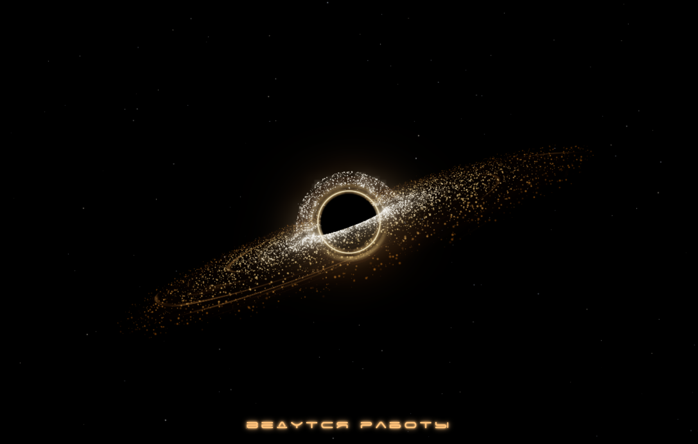

# Black Hole — заставка «Ведутся технические работы»

[](LICENSE)
[](https://github.com/ruslan-onishchenko/blackhole/releases)

Загрузочная (maintenance) страница на случай проведения работ на сайте: вместо скучной заглушки — интерактивная в реальном времени сцена чёрной дыры с аккреционным диском, фотонным кольцом, звёздным полем и надписью «ведутся технические работы».



## Возможности

- **Чёрная дыра** — горизонт событий, фотонное кольцо и гало на кастомных GLSL-шейдерах
- **Аккреционный диск** — процедурный диск с ~10 000 частиц, доплеровским свечением и пеленой (veil)
- **Звёздное поле** — ~1400 звёзд с мягким проявлением при загрузке
- **Постобработка** — композер с bloom-эффектом и маской ядра (core mask)
- **Адаптивное качество** — автоматическое снижение pixel ratio / количества частиц при просадке FPS
- **Доступность** — поддержка `prefers-reduced-motion` (анимация замедляется до 5%)
- **Фолбэк** — при отсутствии WebGL или ошибке загрузки шейдеров показывается статичная заглушка (класс `no-webgl` на `<html>`)

## Технологии

- [Three.js 0.160](https://threejs.org/) (устанавливается через npm и бандлится при сборке)
- WebGL 2 / WebGL + GLSL-шейдеры
- [Vite](https://vite.dev/) — dev-сервер и продакшн-сборка с минификацией
- [Terser](https://terser.org/) — минификатор JS (наследник UglifyJS с поддержкой ES-модулей), подключён в `vite.config.js`
- Чистый JavaScript (ES-модули), без рантайм-зависимостей кроме Three.js

## Структура проекта

```
blackhole/
├── index.html          # точка входа
├── css/style.css       # стили страницы и статичного фолбэка
├── js/
│   ├── main.js         # инициализация, рендер-цикл, камера, качество
│   ├── scene.js        # сцена и камера
│   ├── blackHole.js    # горизонт событий, фотонное кольцо, гало
│   ├── accretionDisk.js# частицы аккреционного диска
│   ├── stars.js        # звёздное поле
│   ├── postprocessing.js # bloom и маска ядра
│   ├── quality.js      # адаптивное качество рендера
│   ├── label.js        # надпись «ведутся технические работы»
│   └── debug.js        # отладочная панель
├── shaders/            # .vert / .frag шейдеры
├── fonts/              # шрифт Space Age Cyrillic
├── public/             # статические ассеты, копируются в dist как есть
│   ├── shaders/        # шейдеры (загружаются по fetch в рантайме)
│   ├── fonts/          # шрифты
│   └── params.json     # сохранённые параметры отладочной панели
└── dist/               # результат продакшн-сборки (gitignore)
```

## Команды

```bash
npm install     # установка зависимостей

npm run dev     # dev-сервер с hot reload (http://localhost:5173)

npm run build   # продакшн-сборка с минификацией в dist/
                # (JS минифицируется Terser'ом, CSS и HTML — встроенными
                #  минификаторами Vite, файлы получают хэш в имени)

npm run preview # локальный предпросмотр собранной версии (http://localhost:4173)
```

Результат сборки — содержимое каталога `dist/`: один минифицированный JS-бандл (~516 КБ, ~128 КБ gzip вместе с Three.js), минифицированный CSS и скопированные без изменений `shaders/`, `fonts/` и `params.json` из `public/`.

## Docker

Продакшн-образ на базе веб-сервера [Angie](https://en.angie.software/angie/docs/installation/docker/) (официальный образ `docker.angie.software/angie:1.12.2-minimal`, Alpine). Многоэтапная сборка: Node 24 собирает сайт через Vite, затем статики копируются в Angie. Раздача по HTTPS с сертификатом [Let's Encrypt](https://letsencrypt.org/) через certbot-сайдкар.

Перед первым запуском замените `<домен>` и `<email>` в `docker/angie.conf` и командах ниже.

### Первый запуск (однократно)

```bash
# 0. Убедиться, что порт 80 свободен (никакой другой веб-сервер не слушает)
docker compose down
ss -tlnp | grep -E ':80\b|:443\b'   # вывод должен быть пустым

# 1. Получить сертификат Let's Encrypt (--no-deps — не запускать Angie)
docker compose run --rm --no-deps -p 80:80 --entrypoint certbot certbot \
  certonly --standalone --email <email> -d <домен> \
  --agree-tos --no-eff-email

# 2. Собрать и запустить стек
docker compose up -d --build
```

Сайт доступен по `https://<домен>`; HTTP автоматически редиректит на HTTPS (кроме ACME-челленджей).

### Продление сертификата

Автоматическое: контейнер certbot каждые 12 часов выполняет `certbot renew` (webroot-челлендж, без простоя), а контейнер Angie каждые 6 часов перезагружает конфиг и подхватывает продлённый сертификат.

Проверка вручную:

```bash
docker compose run --rm --entrypoint certbot certbot renew --dry-run
```

### Минификация

JS минифицируется [Terser](https://terser.org/) (конфигурация в `vite.config.js`):

- `compress` c `drop_console` и `drop_debugger` — из бандла удаляются все вызовы `console.*` и `debugger`
- `mangle.toplevel` — переименовываются все переменные, включая верхнего уровня
- `format.comments: false` — удаляются комментарии

CSS и HTML минифицируются встроенными средствами Vite.

## Настройка

### Текст и вид надписи

Надпись «ведутся технические работы» задаётся в `js/label.js` (переменная `el.textContent`) — там же настраиваются размер, цвет, свечение и отступ. Актуальные значения продублированы в `public/params.json`.

### Параметры сцены

Все параметры (количество частиц, радиусы диска, положение камеры, интенсивность свечения и т.д.) сохраняются из отладочной панели в `public/params.json` и могут быть перенесены в соответствующие модули `js/`.

### Цветовая тема

Цвет свечения и текста настраивается в шейдерах (`shaders/*.frag`) и в `js/label.js`.

## Совместимость

- Современные браузеры с поддержкой WebGL (Chrome, Firefox, Safari, Edge)
- На мобильных устройствах автоматически снижается pixel ratio и количество частиц
- Без WebGL показывается статичный фолбэк на чистом CSS

## Лицензия

Проект распространяется по лицензии [GNU AGPL v3](LICENSE) (или более поздней версии, на ваш выбор). Кратко: вы можете свободно использовать, изучать, изменять и распространять проект, но любые модификации, предлагаемые пользователям по сети (включая хостинг изменённой версии сайта), должны публиковаться под той же лицензией с открытым исходным кодом. Полный текст — в файле [LICENSE](LICENSE).
